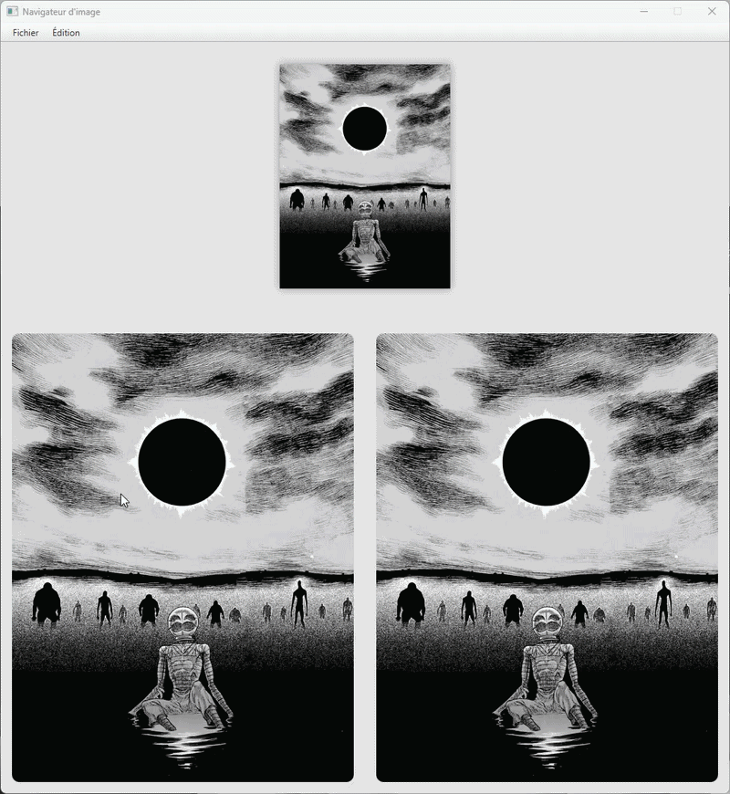
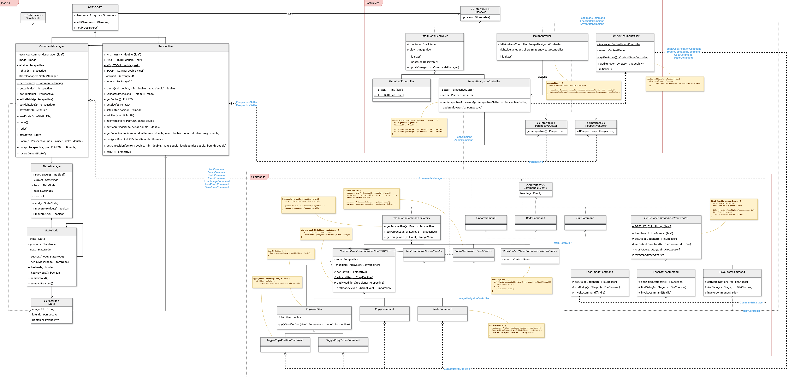

# Image Manipulation Application

## Project Overview
This repository contains an academic project focused on software architecture and design patterns. 
The application is an image manipulation tool built with Java and JavaFX. It allows users to visualize a single 
uploaded image through multiple independent viewports and manipulate their perspectives. The primary goal 
of this project was to design, implement, and integrate a multitude of software design patterns in a 
cohesive, functional application to ensure maintainability, low coupling, and scalability.

## Features
* **Independent Viewports:** The application features two distinct image navigation viewports alongside a thumbnail overview.
* **Navigation Controls:** Users can independently pan and zoom within each viewport.
* **Attribute Transfer:** A context menu allows users to copy the perspective of one viewport and paste it into another. Users can selectively transfer the zoom level, the spatial position, or both.
* **State Persistence:** The current state of the application can be saved to a serializable file and reloaded in subsequent sessions.
* **Command History:** The application maintains a history of actions, supporting robust undo and redo capabilities.

## Architecture and Design Patterns
The system is structured upon the Model-View-Controller (MVC) architectural pattern. The user interface is built using 
FXML, the model encapsulates the application logic and perspective bounds, and the controllers manage user interactions. 
The application leverages the following design patterns:

### Command
All user interactions and event handlers are encapsulated as concrete command classes implementing a generic `Command` 
interface. Navigation events are managed by `PanCommand` and `ZoomCommand`, while file operations are handled by 
respective dialog commands. This structure decouples the user interface from the business logic and centralizes 
state modifications within the model layer.

### Memento
The undo and redo features utilize the Memento pattern to capture and restore the application state. The `CommandsManager` 
acts as the Originator to create a `State` record. A custom doubly linked list implementation within the `StatesManager` 
serves as the Caretaker to manage the history of these states.

### Observer
The application interface synchronizes with the underlying data model through the Observer pattern. The `CommandsManager` 
functions as the Observable subject. The JavaFX controllers act as Observers and update their respective `ImageView` 
components upon receiving notification of state changes.

### Singleton
The Singleton pattern restricts the instantiation of core management classes to a single object. The `CommandsManager` 
is a Singleton to prevent duplicate states and ensure a universal point of access. The `ContextMenuController` 
also utilizes this pattern to propagate its functionalities across all viewports without redundancy.

### Template Method
File dialog operations standardize their execution flow through the Template Method pattern. An abstract `FileDialogCommand` 
class defines the sequence for configuring and displaying a JavaFX `FileChooser`. 
Subclasses override specific primitive operations to customize dialog options and handle the selected files for 
saving or loading data.